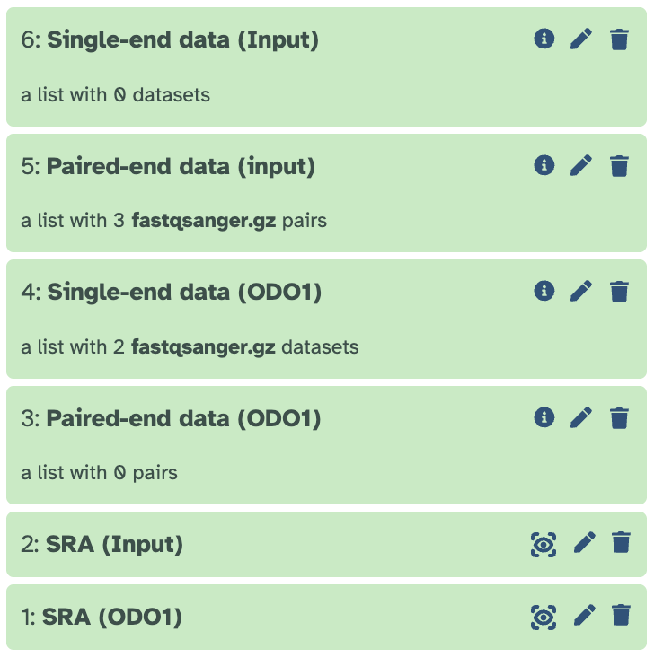
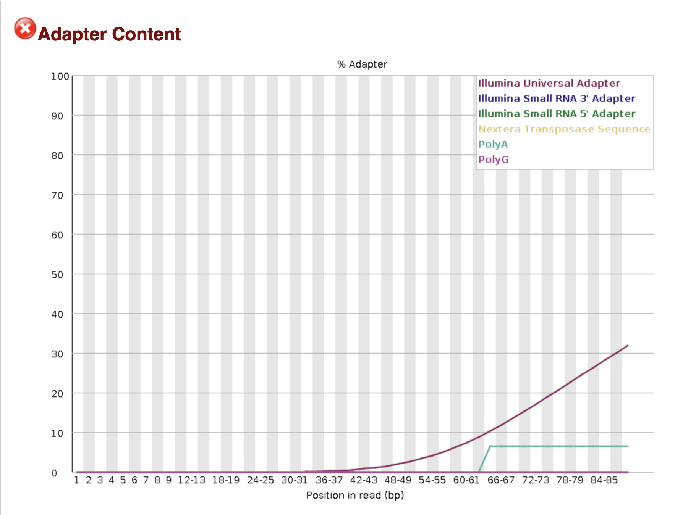
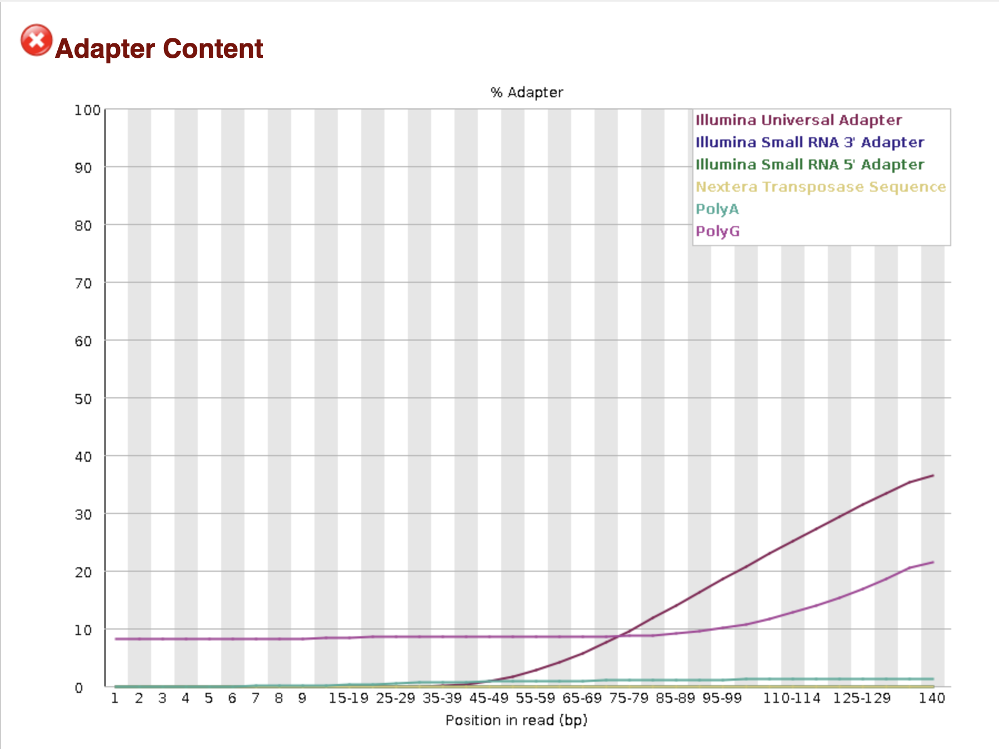
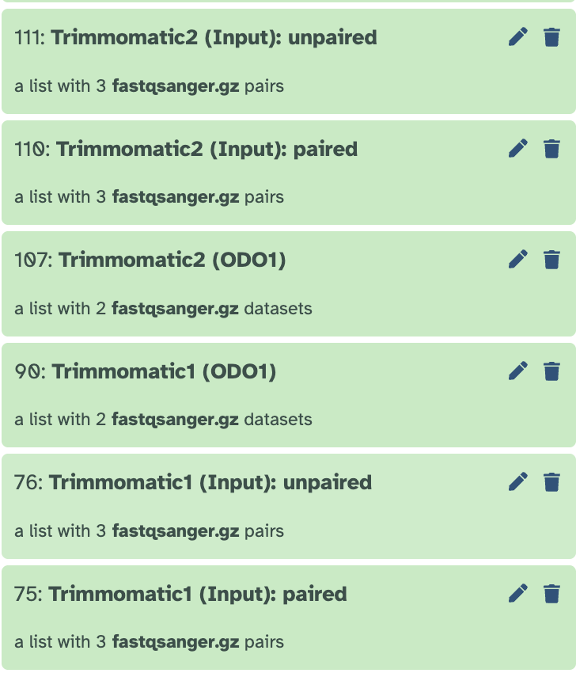
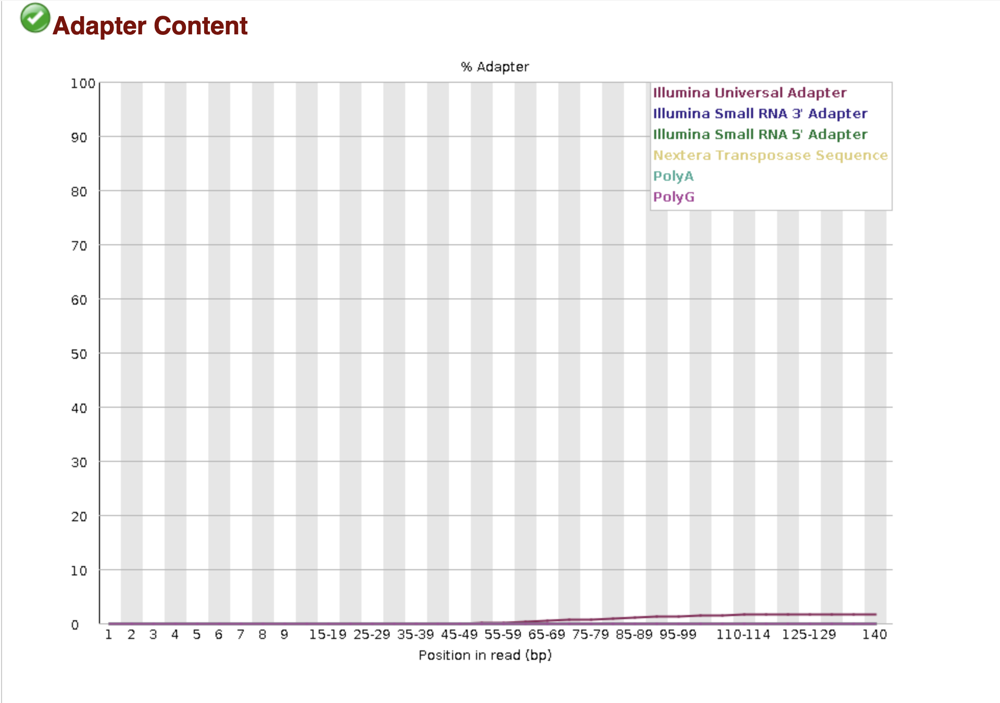
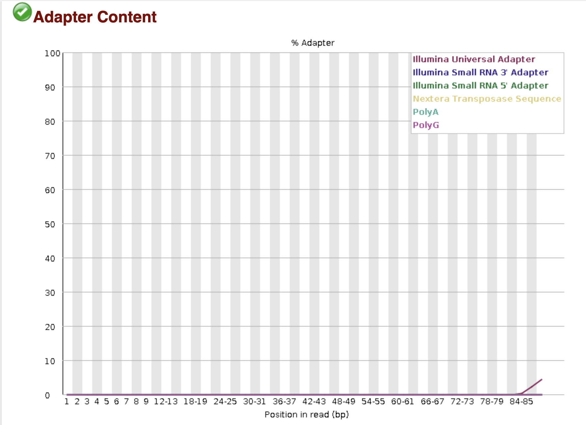
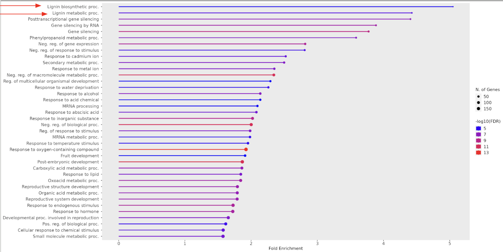
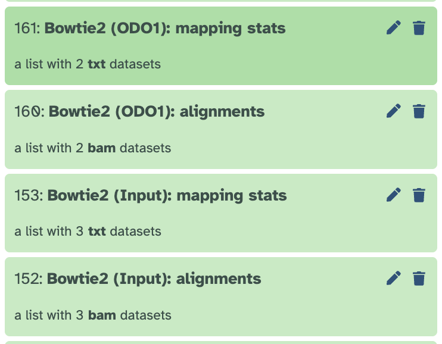
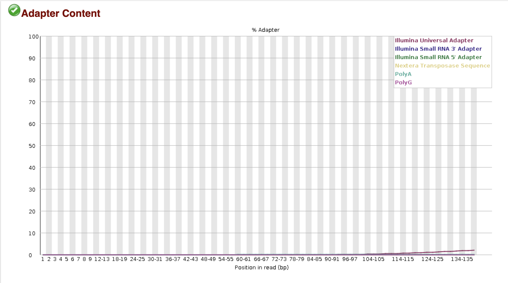

# Combining-RNA-seq-and-ChIP-seq-analysis-using-Galaxy
This is an example workflow that combines ChIP-seq and RNA-seq analysis primarily using Galaxy. We are using a [dataset](https://www.ncbi.nlm.nih.gov/Traces/study/?acc=PRJNA729780&o=acc_s%3Aa) from [Boersma et al's study](https://pmc.ncbi.nlm.nih.gov/articles/PMC9306810/) investigating the role of ODO1 in the production of FVBPs in Petunia flowers. FVBPs (floral volatile benzoid and phenylpropanoid compounds) are specialized metabolites that produce scent bouquets in Petunia flowers. ODO1 have been found to be a master regulator of metabolic FVBP synthesis and emission. However, the way in which ODO1 regulate the synthesis and emission of FVBPs in the Petunia was unknown. 

Thus, the  authors used *ChIP-seq* to identify the direct genomic targets of the ODO1 transcription factor in petunia flowers. Two transgenic petunia flowers were used :  
- pODO1:GFP‐ODO1
  -  uses the natural ODO1 promoter (pODO1)
  - crucial for observing when and where the protein is normally present—such as its diurnal oscillation (with levels peaking in the evening), reflecting the actual biological scenario in petunia flowers.

- 35S:GFP‐ODO1
  - 35S is a constitutive promoter from the cauliflower mosaic virus
  - This ensures that GFP‐ODO1 is expressed at high levels in a more uniform manner, regardless of the endogenous regulatory cues.
 
Using both the native promoter construct (pODO1:GFP‐ODO1) and the overexpression construct (35S:GFP‐ODO1) allowed the researchers to compare the binding profiles. Only those binding peaks detected in both setups were considered high-confidence, thereby minimizing the risk of false positives.

The authors used *RNA-seq* to determine whether the genes bound by ODO1 (as shown by ChIP‐seq) actually exhibited changes in expression when ODO1 was suppressed. This validation helps distinguish between direct targets (whose expression changes are directly linked to ODO1 binding) and indirect effects. RNA-seq was performed on WT and odo1i (ODO1 RNAi knockdown line) transgenic petunia flowers


## Table of contents

- ChIP-seq analysis
  - [Step 1: Import data](#step-1-import-data)
  - [Step 2: Quality control using FastQC](#step-2-quality-control-using-fastqc)
  - [Step 3: Trim using Trimmomatic ](#step-3-trim-using-trimmomatic)
  - [Step 4: Map reads to Petunia genome using Bowtie2](#step-4-map-reads-to-petunia-genome-using-bowtie2)
  - [Step 5: Merge Input files using MergeSamFiles](#step-5-Merge-Input-files-using-MergeSamFiles)
  - [Step 6: Find common peaks between the 2 petunia lines using Bedtools Intersect intervals](#step-6-Find-common-peaks-between-the-2-petunia-lines-using-Bedtools-Intersect-intervals)
  -  [Step 7: bedtools Intersect intervals to find common peaks between the 2 petunia lines](#step-7-bedtools-Intersect-intervals-to-find-common-peaks-between-the-2-petunia-lines)
  -  [Step 8: Gene Ontology](#step-8-gene-ontology)

- RNA-seq analysis
  - [Step 1: Import data](#step-1-import-data)
  - [Step 2: Quality control using FastQC](#step-2-quality-control-using-fastqc)
  - [Step 3: Trim using Trimmomatic ](#step-3-trim-using-trimmomatic)
  - [Step 4: Align reads to Petunia genome using HISAT2](#step-4-Align-reads-to-Petunia-genome-using-HISAT2)
  - [Step 5: Count the number of aligned reads that overlapp Petunia gff annotation file using Htseq-counts](#step-5-Count-the-number-of-aligned-reads-that-overlapp-Petunia-gff-annotation-file-using-Htseq-counts) 
  - [Step 6: Find differentially expressed genes using DESeq2](#step-6-Find-differentially-expressed-genes-using-DESeq2) 
  - [Step 7: Gene Ontology](#step-7-gene-ontology)

- Combining ChIP-seq and RNA-seq analyses
  -  [Step 1: Finding overlapping genes between genes that were downregulated in odo1i and odo1-bound genes](#step-1-Finding-overlapping-genes-between-genes-that-were-downregulated-in-odo1i-and-odo1-bound-genes) 
  -  [Step 2: Create 3 files of filtered gff based off of the 3 gene lists](#step-2-Create-3-files-of-filtered-gff-based-off-of-the-3-gene-lists) 
  - [Step 3: Motif analysis using memeChIP](#step-3-motif-analysis-using-memeChIP)
    

### ChIP-seq analysis
#### Step 1: Import data
We will first download the IP dataset, from this [website](https://www.ncbi.nlm.nih.gov/Traces/study/?acc=PRJNA729780&o=acc_s%3Aa), click on the boxes next to the SRR number for the 	
ChIP-seq data (SRR14528049 and SRR14528050) and then press the the galaxy button shown in the picture below. This will automatically bring you to Galaxy (Note that you will have to create a Galaxy account to get enough memory to do this analysis). Name this SRA collection ***SRA(ODO1)***. 

Then, we will download the background control(input) dataset. From this [website](https://www.ncbi.nlm.nih.gov/Traces/study/?acc=PRJNA650505&o=acc_s%3Aa), click on the boxes for SRR12442821,  SRR12442822 and SRR12442825,  then press the Galaxy button. Name this SRA collection ***SRA(Input)***. 

Then go to ```tools``` → ```Get Data``` → ```Download and Extract Reads in FASTQ format from NCBI SRA```

Use the following settings:
* ```select input type```: list of SRA accession, one per line
* Under ```sra accession list```, input your SRA collection (i.e. ***SRA(ODO1)***/ ***SRA(Input)***)
* ```select output format```: gzip compressed fastqc
Then press ```Run Tool```. Run it twice, once for each SRA collection in your history


After it has finished running, for the ODO1 dataset, you should see ***a list with 2 fastqsanger.gz pairs*** under ***Single-end data (fastq-dump)*** and ***a list with 0 datasets*** under ***Paired-end data (fastq-dump)***. For, the input dataset, you will see ***a list with 3 fastqsanger.gz pairs*** under ***Paired-end data (fastq-dump)*** and ***a list with 0 datasets*** under ***Single-end data (fastq-dump)***



#### Step 2: Quality control using ```FastQC```

Run fastQC on ***Single-end data (ODO1)*** and ***Paired-end data (Input)***. From the fastQC report, we can see that the ODO1 dataset have a high percentage of polyA sequence and the Input dataset have a high percentage of PolyG sequence. 




#### Step 3: Trim using ```Trimmomatic``` 

Run ```Trimmomatic``` twice on each dataset collection

For the ODO1 dataset:
##### For the 1st run:
- input: ```Single-end or paired-end reads?```: single-end
  - ***SRA(ODO1)***
- Use the following settings:
     - ```Perform initial ILLUMINACLIP step?``` : Yes
          - ```Select standard adapter sequences or provide custom?```: Standard
     - ```Adapter sequence to use```: TruSeq3 (single-ended, for MiSeq and HiSeq)

##### For the 2nd run:
- input: ```Single-end or paired-end reads?```: single-end
  - ***SRA(ODO1)***
- Use the following settings:
     - ```Perform initial ILLUMINACLIP step?``` : Yes
          - ```Select standard adapter sequences or provide custom?```: custom
     - ```Adapter sequence```:
  ```
          > polyA
            AAAAAAAAAAAAAAAAAAAAAAAAAAAAAAAAAAAAAAAAAAAAAAAAAA
  ```

 
For the Input dataset:
##### For the 1st run:
- input: ```Single-end or paired-end reads?```: paired-end (as a collection)
  - ***SRA(Input)***
- Use the following settings:
   ```Perform initial ILLUMINACLIP step?``` : Yes
          - ```Select standard adapter sequences or provide custom?```: Standard
     - ```Adapter sequence to use```: TruSeq3 (paired-ended, for MiSeq and HiSeq)

##### For the 2nd run:
- input: ```Single-end or paired-end reads?```: paired-end (as a collection)
  - ***SRA(Input)***
- Use the following settings:
     - ```Perform initial ILLUMINACLIP step?``` : Yes
          - ```Select standard adapter sequences or provide custom?```: custom
     - ```Adapter sequence```:
  ```
          > polyA
            GGGGGGGGGGGGGGGGGGGGGGGGGGGGGGGGGGGGGGGGGGGGGGGGGG
  ```


For the output of trimmomatic for the Input dataset, we will get paired and unpaired, we will use the paired output. 



Now we will only be using ***trimmomatic2 (ODO1)*** and ***trimmomatic2 (Input): paired***

Then run fastQC on ***trimmomatic2 (ODO1)*** and ***trimmomatic2 (Input): paired*** to see whether trimmomatic has succesfully trimmed out the adapter sequence and polyG sequence. Now in the fastQC report, we can see that we have trimmed out the adapter sequences. 





#### Step 4: Map reads to Petunia genome using ```Bowtie2```
Download the [petunia genome fasta file](https://solgenomics.sgn.cornell.edu/organism/Petunia_axillaris/genome) and upload it to Galaxy

Run ```Bowtie2``` twice: Once with ***trimmomatic2 (ODO1)*** as the input and once with ***trimmomatic2 (Input): paired*** as the input 

Use the following settings:
- ```Will you select a reference genome from your history or use a built-in index?```: Use a genome from history and build indes
     -```Select reference genome```: petunia genome fasta file
- ```Select analysis mode```
     -```Do you want to use presets?```: No, just use defaults
- ```Save the bowtie2 mapping statistics to the history``` : Yes
  
you will get 2 Bowtie2 outputs for each dataset: alignments and mapping stats.I named the outputs ***Bowtie2(Input):alignments***, ***Bowtie2(Input):mapping stats***, ***Bowtie2(ODO1):alignments***, ***Bowtie2(ODO1):mapping stats***. 
From the mapping stats output you can see how mappy percentage of reads were mapped. Generally a percentage above 80% is considered good. 


#### Step 5: Merge Input files using ```MergeSamFiles``` 
We have 3 Input samples in our dataset colleciton so we want to combine them into 1 file for cleaner, consolidated background control in MACS2 peak calling

Use the following settings:
- ```Select SAM/BAM dataset or dataset collection``: Bowtie2(Input):aligments

I named the output: ***MergeSamFiles on input***


#### Step 6: Find peaks using ```MACS2 callpeak``` 
```MACS2 callpeak``` is used to identify enriched regions of DNA — called "peaks" — from ChIP-seq data. It basically looks for places in the genome where there are many sequencing reads aligned to it which indicates where CTCF binds. 

Use these settings:
-```ChIP-Seq Treatment File``` : ***Bowtie2(ODO1):alignments***
- ```Do you have a Control File?```: yes
   - ```ChIP-Seq Control File``` : ***MergeSamFiles on input***


Use the following settings:
- ```Format of Input Files``` : Single-end BAM
- ```Effective genome size``` :1200000000


#### Step 7: Find common peaks between the 2 petunia lines using ```Bedtools Intersect intervals``` 
First we have to extract the 2 datasets from ***MACS2 callpeak (narrow peaks)***

Run ```Extract dataset``:
- ```Input List``` : ***MACS2 callpeak (narrow peaks)***
     - ```How should a dataset be selected?```: Select by index
     -``` Element index```: 0 and 1 //Run once with element index as 0 and run once with element index as 1.

For the output with element index as 0 (SRR14528049), name it ***MACS2 callpeak (35S:GFP-ODO1)***. For the output with element index as 1 (SRR14528050), name it ***MACS2 callpeak (pODO1:GFP-ODO1)***

Then we want to find the peaks that are common between the 2 lines: pODO1:GFP-ODO1 and 35S:GFP-ODO1. 
Use the following settings:
- ```File A to intersect with B ```: ***MACS2 callpeak (35S:GFP-ODO1)***
-  ```Combined or separate output files ```: One output file per 'input B' file
  -  ```File B to intersect with A ```: ***MACS2 callpeak (pODO1:GFP-ODO1)***
-  ```Calculation based on strandedness? ```: Overlaps on either strand

I named the output ***bedtools Intersect intervals on pODO1:GFP-ODO1 and 35S:GFP-ODO1***

Then we will run ```Bedtools Intersect intervals```  again to find the intersection between the peaks found in ***bedtools Intersect intervals on pODO1:GFP-ODO1 and 35S:GFP-ODO1*** and the Petunia GFF annotation. This is  done to identify which genes are likely direct targets of ODO1.


#### Step 8: Gene Ontology
Download the bed output from ***bedtools Intersect intervals on pODO1:GFP-ODO1 and 35S:GFP-ODO1***. We want to extract the geneIDs
'''
input_file = "/Users/chiarasantoso/Desktop/bedtools_Intersect_intervals_on_peaks_and_gff.bed"
output_file = "/Users/chiarasantoso/Desktop/odo1_target_petunia_genes.txt"

gene_ids = set()

with open(input_file) as f:
    for line in f:
        fields = line.strip().split("\t")

        # Check that this line refers to a 'gene' feature from GTF
        if len(fields) > 12 and fields[12] == "gene":  # make sure to only extract gene IDs from actual gene entries
            attributes = fields[18]  # GTF attributes field
            for item in attributes.split(";"):
                item = item.strip()
                if item.startswith("ID="):
                    gene_id = item.split("=")[1]
                    gene_ids.add(gene_id)

# Save to file
with open(output_file, "w") as out:
    for gid in sorted(gene_ids):
        out.write(gid + "\n")

print(f"✔️ Extracted {len(gene_ids)} unique gene IDs to: {output_file}")
'''
This gave me 2170 geneIDs. Insert these gene IDs to [shinyGo](https://bioinformatics.sdstate.edu/go/). 



These are the pathways I got. As we can see, ODO1- bound genes were involved in the lignin biosynthetic process, indicating that ODO1 may also play a role in directly regulating genes that are responsible for generating the monolignol precursor coniferyl alcohol for the synthesis of the FVBPs eugenol and isoeugenol. ODO1 is also associated with phenylpropanoid metabolic process, consistent with previous observations that ODO1 regulates genes in the shikimate pathway in order to increase Phe biosynthesis


### RNA-seq analysis
#### Step 1: Import data
We will first download the IP dataset, from this [website](https://www.ncbi.nlm.nih.gov/Traces/study/?acc=PRJNA729780&o=acc_s%3Aa), click on the boxes next to the SRR numbers for the 	
RNA-seq data (SRR14528051, SRR145280512, SRR14528053, SRR14528054, SRR14528055, SRR14528056) and then press the the galaxy button shown in the picture below.

Then go to ```tools``` → ```Get Data``` → ```Download and Extract Reads in FASTQ format from NCBI SRA```

Use the following settings:
* ```select input type```: list of SRA accession, one per line
* ```sra accession list```: ***SRA***
* ```select output format```: gzip compressed fastqc
Then press ```Run Tool```. Run it twice, once for each SRA collection in your history

You will see ***a list with 6 fastqsanger.gz pairs*** under ***Paired-end data (fastq-dump)*** and ***a list with 0 datasets*** under ***Single-end data (fastq-dump)***. 


#### Step 2: Quality control using ```FastQC```
Run fastQC on ***Paired-end data (fastq-dump)***. From the fastQC report, we can see the adapter content is very low which is good, however, we can still run trimmomatic to remove the small percentage of Ilumina universal adapter. 



#### Step 3: Trim using ```Trimmomatic``` 
Use the following settings: 
- input: ```Single-end or paired-end reads?```: paired-end (as a collection)
  - ***SRA(Input)***
- Use the following settings:
   ```Perform initial ILLUMINACLIP step?``` : Yes
          - ```Select standard adapter sequences or provide custom?```: Standard
     - ```Adapter sequence to use```: TruSeq3 (paired-ended, for MiSeq and HiSeq)
 
we are only going to use the apired output( ***Trimmomatic:paired***)

Then run fastQC on  ***Trimmomatic:paired*** to see whether trimmomatic has succesfully trimmed out the adapter sequence. Now in the fastQC report, we can see that we have trimmed out the adapter sequences. 


#### Step 4: Align reads to Petunia genome using ```HISAT2```
HISAT2 employs a graph FM index and hierarchical indexing strategy which means that it employs two types of indexes: (1) one global FM index representing the whole genome, and (2) many separate local FM indexes for small regions collectively covering the genome. 

The way it works is that it builds a genome index and a splicing graph index (from a GTF/GFF). This lets HISAT2 search efficiently through known exon-exon junctions and novel junctions. When a read fails to align contiguously, HISAT2 attempts to align across known or inferred introns by referencing its splicing graph. It can match reads even if they’re split across multiple exons, using either annotation or read evidence. This makes HISAT2 extremely efficient for genomes with alternative splicing

Use the following settings:
- ```Source for the reference genome```: [petunia cDNA fasta file](https://solgenomics.sgn.cornell.edu/organism/Petunia_axillaris/genome) 
- ```Is this a single or paired library```: Paired-end Dataset Collection
  - ```Paired Collection ```: ***Trimmomatic:paired***
 
There are 2 outputs ***HISAT2: Mapping summary*** and ***HISAT2: aligned reads (BAM)***
From ***HISAT2: Mapping summary*** you can see what percentage of the reads were mapped. 


#### Step 5: Count the number of aligned reads that overlap Petunia gff annotation file using ```Htseq-counts```
HTSeq-count takes an alignment file (typically in SAM or BAM format) containing sequencing reads mapped to a reference genome and an annotation file (usually in GTF or GFF format) that describes genomic features (such as genes or exons). Its main function is to count the number of reads that map to each genomic feature. HTSeq-count outputs 2-column tab-delimited text file where the first column is the Gene ID and the 2nd column is the counts. There are 5 rows in the bottoms that do not correspond to geneIDs 
 - __no_feature	->  reads that didn’t overlap any feature (e.g. intergenic)
 - __ambiguous	-> reads that overlapped multiple genes and can’t be assigned
 - __alignment_not_unique ->	reads that map to multiple locations in the genome
 - __not_aligned	-> reads that did not map at all
 - __too_low_aQual	-> reads with low mapping quality (if you enabled filtering)

Use the following settings:
- ```Aligned SAM/BAM File``` : ***HISAT2: aligned reads (BAM)***
- ```GFF/GTF File```: [petunia genome gff file](https://solgenomics.sgn.cornell.edu/organism/Petunia_axillaris/genome)
- ```Mode``` : Union
- ```Minimum alignment quality```: 30
- ```ID Attribute```: ID

I named the output ***htseq-count***


#### Step 6: Find differentially expressed genes using ```DESeq2``` 
DESeq2 is a statistical tool used for differential gene expression analysis from count data. It can help us answer the question: Which genes are significantly upregulated or downregulated between odo1i transgenic flower and wt. 

Before we run ```DESeq2```  we are going to extract all of the 6 different samples from ***htseq-count***

Go to ```Extract Dataset```. 
- ```Input List``` : ***htseq-count***
     - ```How should a dataset be selected?```: Select by index
     -``` Element index```: 0-5 //Run once with element index as each digit from 0 to 5


Do the same thing for ***Samtools view on ctcf mutant***. This will basically seperate all of out single datasets. As a results, we will ahve all of the SRR numbers in our history. Rename the SRR numbers as follows:
- SRR14528051 → ***odo1i(1)***
- SRR14528052 → ***odo1i(2)***
- SRR14528053 → ***odo1i(3)***
- SRR14528054 →  ***WT(1)***
- SRR14528055 →  ***WT(2)***
- SRR14528056 →  ***WT(3)***


Run ```DESeq2```:
-```Specify a factor name, e.g. effects_drug_x or cancer_markers```: odo1_effects
  -   ```Factor level```
    -   1: Factor level
      - ``` Specify a factor level, typical values could be 'tumor', 'normal', 'treated' or 'control'```: odo1i
      - ```Counts file(s)``` : ***odo1i(1)***, ***odo1i(2)***, ***odo1i(3)***
    -   2: Factor level
      - ``` Specify a factor level, typical values could be 'tumor', 'normal', 'treated' or 'control'```: WT
      - ```Counts file(s)``` : ***WT(1)***, ***WT(2)***, ***WT(3)***
   - ```Choice of Input data```: Count data
 - Output options: Generate plots for visualizing the analysis resutls


There are 2 outputs. The DESeq2 plots output and the DESeq2 Result Table. I named the outputs ***DESeq2 plots*** and ***DESeq2 results file*** One of the plots in the plot output is the PCA plot


From this plot we can imply that PC1 is the treatment (wt vs odo1i) because the odo1i samples are all on around the same scale in the x axis. The wt samples are more variable with wt1 is the most different to the odoi1 line, while wt2 is similar to the odo1i samples. Thus, wt1 is probably driving the most difference in PC1. We can also imply that PC2 is variation within replicates. 

To more clearly visualize the top upregulated and downregulated genes in the odo1i line, we will make a volcano plot. 

Go to ```Volcano Plot```:
- ```Specify an input file```: ***DESeq2 results file***
- make sure all of the column numbers are right for all of the different categories


The output is a volcano plot of the top 10 deregulated genes in the odoi line. Because the aim of this is to find what genes odo1 is involved in, we will focus on the downregulated genes in odo1i line. These are the top 3 downregulated petunia genes. 
- The first one is Peaxi162Scf01226g00004 which is involved in transcribing B12-binding SAM proteins which help regenerate methionine keeping SAM levels high. Which then allows SAM-dependent methylation of phenylpropanoid intermediates to produce fvbp compounds
- The second one is Peaxi162Scf00954g00024 which correspond to the C4H gene,which plays a crucial role in the phenylpropanoid pathway, specifically in the production of p-coumaric acid, a precursor for many FVBPs.
- The third one is Peaxi162Scf00652g00015 which corresponds to the SAHH1 gene which is one of the genes that the paper found to be involved in the SAM and folate cycle. SAHH1 hydrolyzes SAH which inhibit methyltransferases.By removing SAH, SAHH1 maintains methylation capacity by allowing SAM-dependent methyltransferases to function which is needed to produce many FVBP compounds


#### Step 7: Gene Ontology
From the deseq results we want to filter the genes based off of a p-adj value of 0.05 and get a list of downregulated and upregulated gene IDs. 

'''
input_file = "DESeq2_results_file.tabular" # path to your DESeq2 output
up_file = "upregulated.txt"
down_file = "downregulated.txt"

with open(input_file) as f, \
     open(up_file, "w") as up, \
     open(down_file, "w") as down:

    header = f.readline().strip().split("\t")
    gene_idx = header.index("GeneID")
    lfc_idx = header.index("log2(FC)")
    padj_idx = header.index("p-adj")

    for line in f:
        fields = line.strip().split("\t")
        try:
            gene_id = fields[gene_idx].split(":exon")[0]
            lfc = float(fields[lfc_idx])
            padj = float(fields[padj_idx])

            if padj < 0.05:
                if lfc > 0:
                    up.write(gene_id + "\n")
                elif lfc < 0:
                    down.write(gene_id + "\n")
        except (ValueError, IndexError):
            continue  # skip malformed lines

print("✔️ Gene lists saved to:")
print(f"  • {up_file}")
print(f"  • {down_file}")

'''

Copy and paste the list of downregulated petunia genes into [shinyGo](https://bioinformatics.sdstate.edu/go/). 
And we found 334 downregulated genes. We did gene ontology on these genes and 2 of the pathways we found most relevant is the lignin metabolic process and phenylpropanoid metabolic process which are both part of FVBP biosynthesis and both also found in the gene ontology of the odo1 abound genes from our chip seq analysis which then just makes the argument stronger that odo1 is involved in these pathways and thus the production of fvbp compounds


Copy and paste the list of upregulated petunia genes into [shinyGo](https://bioinformatics.sdstate.edu/go/)
We also found 269 upregulated genes. What happens when odo1 expression is suppressed is beyond the scope of the paper but we found many signalng pathways  which may have likely be part of the plant's adaptive response in the absence of odo1. Also, pathways such as pectin catabolic process, galacturonan metabolic process are  involved in cell wall organization and modification (pectin, galacturonan) which may as the flower remodels or compensates form the lack of odo1. 


### Combining ChIP-seq and RNA-seq analyses
#### Step 1: Finding overlapping genes between genes that were downregulated in odo1i and odo1-bound genes

So combining our chipseq and rna seq analysis, we found that there are 66 genes that overlap between the genes that were downregulated in odo1i and odo1-bound genes. Which was expected for the role of ODO1 as a positive transcriptional regulator as there is usually a 1–40% overlap between TF‐bound targets and genes that are misregulated under TF perturbation, observed across plants, animals and yeast (Swift and Coruzzi, 2017). 

Possible reasons for the large number of genes that are not overlapping
- The bound but unregulated targets are possibly poised for transcriptional regulation until the desired developmental or environmental cues are perceived. meaning the plant keeps them ready for when the right signal (like a specific developmental stage or environmental stress) appears.In other words, ODO1 is there, but not doing anything yet.
- The regulated but unbound genes could be indirect targets  (ODO1 affects another gene that then regulates them) or could be direct targets in which the interaction with ODO1 was not captured as a result of the transient nature of such interactions or the limitations of the ChIP‐seq technique.
  - For example, the 2‐kbp promoter of the FVBP transporter PhABCG1 has previously been shown to be transcriptionally activated by ODO1 (Van Moerkercke et al., 2012), but did not meet the stringency requirements to be termed an ODO1‐bound gene in this study as it only had binding peaks in the 35S:GFP‐ODO1 library and not in the pODO1:GFP‐ODO1 ChIP‐seq library. It is therefore likely to represent a false negative because of the difficulty in capturing the transient interaction.


We also found 37 overlapping genes between the upregulated geens in odoi1 line and the odo1-bound genes. This was unexpected and indicates a still unknown role of odo1 in repression of the expression of certain genes. It is possible that ODO1 interacts with other transcription factors, which recognize a binding motif different from the canonical MYB binding motif, to downregulate specific gene targets. There is also the possibility of the existence of an incoherent feedforward loop in the ODO1 regulatory network, where ODO1 activates a repressor X that downregulates gene Y, and at the same time binds the promoter of gene Y to prime it for future activation under adequate developmental or environmental conditions. For instance, ODO1 binds and activates MYB4, a negative regulator of the phenylpropanoid pathway in petunia (Colquhoun et al., 2011). Overall, the exact mechanism of how ODO1 controls gene regulation either directly or through downstream targets requires further investigation.


#### Step 2: Create 3 files of filtered gff based off of the 3 gene lists

Upload the gene lists of ODO1-bound genes(from the chipseq section) and the list of upregulated genes and downregulated genes in the odo1i line (from the rnaseq section)

Do this for all 3 gene lists (ODO1-bound(from the chipseq section) , upregulated in the odo1i line, downregulated in the odo1i line(from the rnaseq section))
'''
import pandas as pd

# Load GFF
gff = pd.read_csv("Peaxi162annotation_v4.gff", sep="\t", header=None)

# Keep only 'gene' features 
gff = gff[gff[2] == "gene"]

# Extract gene ID (assumes ID= format)
gff["gene_id"] = gff[8].str.extract(r'(?:ID|gene_id)=([^;]+)')

# Load gene list (no header)
genes = pd.read_csv("odo1-bound.txt", sep="\t", header=None)[0].tolist() 
# Filter GFF
filtered_gff = gff[gff["gene_id"].isin(genes)]

# Drop helper column
filtered_gff = filtered_gff.drop(columns=["gene_id"])

# Save filtered GFF
filtered_gff.to_csv("ODO1_bound.gff", sep="\t", header=False, index=False)

'''
I am going to refer to the 3 files as ***ODO1_bound.gff***, ***upregulated.gff*** and ***downreulated.gff***

#### Step 3: Motif analysis using ```MEME-ChIP``

Upload the 3 gff file to galaxy. 
Before running ```MEME-ChIP``` we have to run ``` bedtools getfasta``` 

Go to ``` bedtools getfasta``` :
- ```BED/bedGraph/GFF/VCF/EncodePeak file```: gff file (run this once for each of the 3 gff files)
- ```Choose the source for the FASTA file```: History
  - ```FASTA file```: [petunia genome fasta file](https://solgenomics.sgn.cornell.edu/organism/Petunia_axillaris/genome)

I named the outputs: ***bedtools getfasta on ODO1-bound***, ***bedtools getfasta on downregulated***, ***bedtools getfasta on upregulated***

Go to  ```MEME-ChIP```:
- ```Primary sequences``` : ***bedtools getfasta on ODO1-bound***/ ***bedtools getfasta on downregulated***/ ***bedtools getfasta on upregulated*** ( run once for each)
- ```Sequence alphabet``` : DNA

A cis motif, CCACCAA was enriched among the promoters of genes bound by ODO1 and similar to the motif of the promotersactivated by ODO1 (i.e. downregulated in odo1i), but was not detected among the promoters of ODO1-bound genes that are upregulated in odo1i (Figure 5b). This motif was therefore considered as a candidate binding site of ODO1 in the promoters of target genes for their transcriptional activation.
The motif 1 identified is similar to the ACC(T/A)ACC motif bound by ZmMYB31, a regulator of the lignin biosyn- thetic pathway in Zea mays (maize) (Fornale et al., 2010). It is also similar to the AC element sequence AC-II (ACCAACC) involved in the regulation of phenylpropanoid and lignin biosynthetic genes in Arabidopsis


